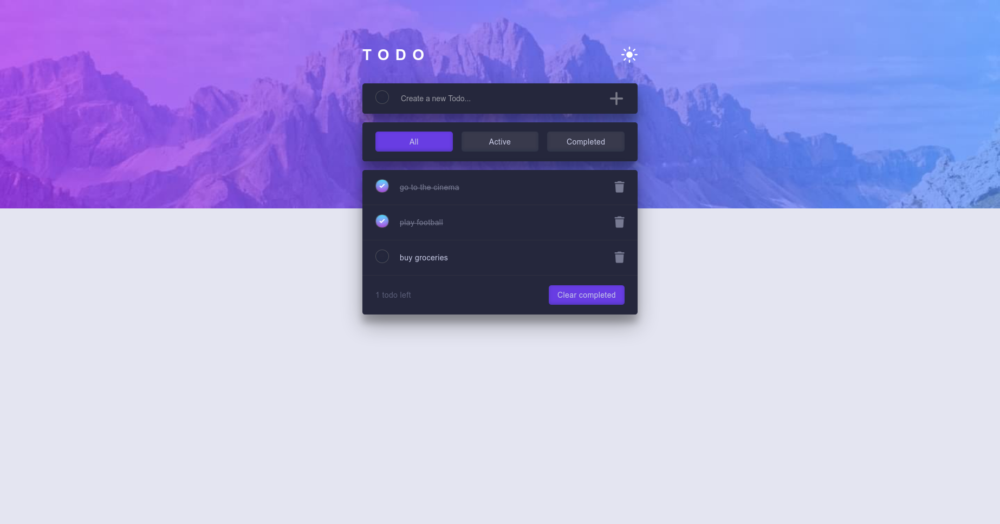
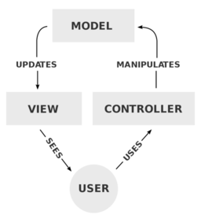

# Todos App - vanilla JavaScript

## Table of contents

- [Overview](#overview)
  - [Screenshot](#screenshot)
  - [Features](#features)
  - [Links](#links)
- [My process](#my-process)
  - [Built with](#built-with)
  - [What I learned](#what-i-learned)
  - [Continued development](#continued-development)
  - [Useful resources](#useful-resources)
- [Author](#author)

## Overview

### Screenshot

### Links

- [Live Site Demo](https://todos-app-js-p01.netlify.app/)
- [Code Repository](https://github.com/MariusHor/todos-app-js)

### Features

- **State management** using _*LocalStorage*_:
  1. Todos are being saved and retrieved on app start
  2. The drag and drop feature is implemented in a way that the new list order is always being saved and retrieved
  3. Selected theme is stored and remembered on refresh
- Basic **_CRUD_ operations** such as:
  1. Adding a new Todo item
  2. Reading the Todos list from LocalStorage
  3. Deleting individual todos / all todos from the list
  4. Editing Todos text or marking them as completed
- **_Filtering_** by all/active/complete todos
- _**Drag and drop**_ to reorder items on the list
- Todos left **_counter_**
- Helpful **_tooltips_** on large screen sizes
- **_Toggling_** between light and dark **mode**
- **_Responsive_** layout

## My process

### Built with

- Mobile-first workflow
- Semantic HTML5 markup
- Scss
- BEM
- Flexbox
- CSS Grid
- JavaScript
- Webpack
- TippyJs

### What I learned

While building this project I wanted to improve my _JavaScript_ skills while searching for better ways of structuring the codebase of a project. Frameworks and libraries nowadays make it easier for us developers to organize our code but jumping straight into that lane was not something that I was considering because I am a firm believer of starting from the basics and understanding the key concepts of a subject before moving forward.

This thought process brought me to the **_Model View Whatever_** architectural patterns, or **Model View \*** in short. The key idea behind it is to split the Application logic into three separate parts:

All patterns that derive from this can be traced back to the Model View Controller pattern which is basically made of:

- the **_Model_**, handling all the data related logic. It only cares about the data it manages but it does not render that data to the screen.
- the **_View_**, handling the presentational logic and displaying the current model state. The view the model listens to changes inside the model data and renders it to the output device.
- the **_Controller_**, concerned with the business logic, it receives user inputs and updates the model

Some benefits that these architectural patterns provide are:

- **_Separation of Concerns_**: each component strictly does what it supposed to only. They all have a purpose, and those purposes are different.
- **_Flexibility_** - it provides the grounds to easily implement new features thus making the application more scalable.
- **_Better code structure_** - the MVC patterns promote an easier understanding of a codebase speeding up the flow when other developers might need to jump in to work on a new project.

In this project I implemented a variation of the MVC pattern called **_Model View Presenter_**. The key differences are:

- The **Model** has the same responsibilities as in the _MVC_ pattern. It might still emit new events when its data change but now it is the _Presenter_ that listens to them and no longer the _View_.
- The **View** is passive: it only receives the data but it does not manipulate it in any way. This task is shifted to the _Presenter_.
- The **Presenter** no longer receives the user inputs like the _Controller_. User inputs are being handled by the _View_ which then sends the information to the _Presenter_. The _Presenter_ validates user inputs and updates the _Model_. It then receives back the state of the app from the _Model_ and decides exactly what needs to be sent to the _View_.

!! Note that in this project I have used _callbacks_ to handle the communication between components but this can also be done with _CustomEvents_ or the _Observer_ or _Publisher/Subscriber_ patterns.

### Continued development

I will continue to research and implement variations of the Model View \* architectural pattern while also improving my general vanilla Javascript skills. While I do agree that such an implementation might actually be an overkill for a simple todo application, I think that it was actually really beneficial for me because it taught many new concepts and helped me realize the importance of a well structured codebase, not only for me but for someone who might review my code as well.

### Useful resources

- [Todo app challenge on Frontend Mentor](https://www.frontendmentor.io/challenges/todo-app-Su1_KokOW) - This gave me the basic styling guidelines to follow while building this project which I used as a starting point on which I built upon where I felt that it was needed.

## Author

- Github - [@MariusHor](https://github.com/MariusHor/)
- Frontend Mentor - [@MariusHor](https://www.frontendmentor.io/profile/MariusHor)
